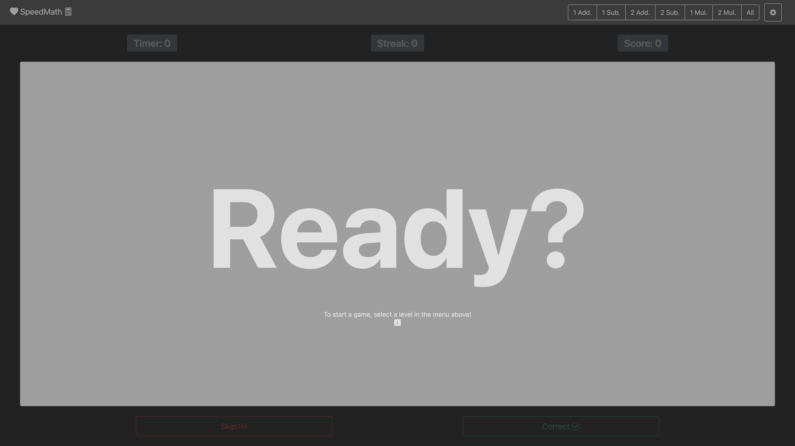
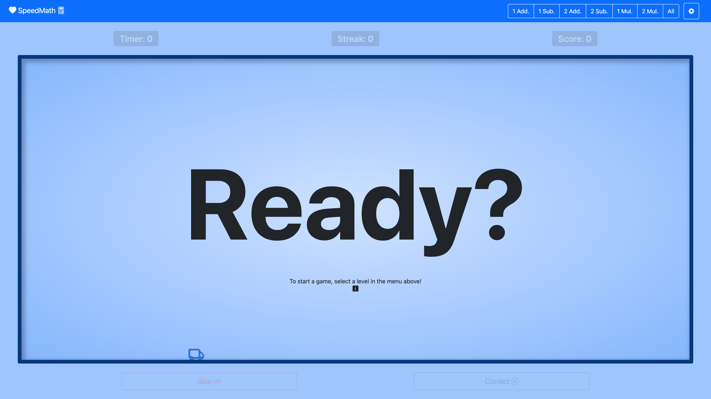

# SpeedMath
SpeedMath by Justin M. Wray

https://wrayjustin.github.io/SpeedMath/ | https://www.justinwray.com

All Rights Reserved

## About
SpeedMath is a web-based, gamified, math problem learning program.

Be sure to check out [SpeedRead](https://wrayjustin.github.io/SpeedRead/) as well, a similiar game for reading! More information on SpeedRead can be found on the SpeedRead [GitHub Repository](https://github.com/wrayjustin/SpeedRead).

### Features
 - Score Tracking & Modes (*See [Scoring Types](#scoring-types)*)
 - Detailed Statistics
     - Overall Scores, Speed, Streaks, etc.
     - Per-Word Accuracy, Speed, etc.
 - Sound Effects and Reading of Skipped Words
 - Game Saves / Resume / Merge (*See [Game Save Data](#game-save-data)*)
 - Multiple Math Levels, by Complexity (*See [Levels](#levels)*)
 - Customizable Settings (*See [Game Settings](#game-settings)*)
 - Multiple Themes/Visuals (*See [Game Settings](#game-themes)*)
 - Keyboard Shortcuts (*See [Keyboard Shortcuts](#keyboard-shortcuts)*)
 - Multi-Platform Support (*See [Requirments](#requirments)*)
 - Full Offline Support (*See [Requirments](#requirements)*)

## Details

### Levels
|Level| Description |
|--|--|
| 1 Add. | Addition of single digitis (e.g., 1 + 7). |
| 1 Sub. | Subtraction of single digits (e.g., 8 - 3). |
| 2 Add. | Addition of two digit numbers (e.g., 56 + 24). |
| 2 Sub. | Subtraction of two digit numbers (e.g., 89 - 12). |
| 1 Mul. | Multiplication of single digits (e.g., 3 x 4). |
| 2 Mul. | Multiplication of double digit numbers (e.q., 33 x 12). |
| All | *[Contains all of the math equation types above.]*

### Scoring Types
SpeedMath contains three scoring modes, providing different methods for incentivizing accurate and timely answers.  The "Game Score Type" can be changed at any time and will automatically update the relevant score displays.

#### Plus-Minus
One point is earned for every correct answer, and one point is lost for every skipped equation. *[This is the default scoring mode.]*

#### Total Stars
The score is based on stars earned by speed, up to five stars per correct answer.  No score reductions for skipped equations. *[Friendly Mode]*

#### Time-Based
Scoring is based on speed, with points added for correct answers and deducted for skipped equations.  The points awarded, or subtracted, are based on the maximum number of seconds spent up to the time limit set. *[Competitive Mode]*

### Game Settings
SpeedMath allows for the customization of various game settings.  The following settings are customizable:
| Action | Key | Default |
|--|--|--|
| Game Score Type | Determines the Scoring Metric (*See [Scoring Types](#scoring-types)*) | `Plus-Minus` |
| Round Time Limit | Time before the equation is skipped automatically.  Also used as the basis for time warnings. | `30` |
| Max Stars Per Round | Maximum amount of stars earned per round; used as the basis for stars awarded for a correct answer. | `5` |
| Custom State Data | (*See [Game Save Data](#game-save-data)*) | -- |
| Game Theme | Visual themes for the interface (*See [Game Settings](#game-themes)*) | `light` |
| Advanced Settings | (*See [Game Save Data](#game-save-data)*) | -- |

Saved changes to these settings will take effect immediately and automatically update relevant statistics.

### Keyboard Shortcuts
To provide for quick and easy proctoring, the game supports keyboard shortcuts to navigate.  The supported keyboard shortcuts are as follows:
| Action | Key |
|--|--|
| Pause/Resume | *Space Bar* |
| Correct Answer | *Right Arrow* |
| Skip Word | *Left Arrow* |

### Game Save Data
Game Data can be saved from the "Game Settings" screen.  Save data is provided in both text form and a sharable URL.  The text version can be copied, stored, and then later pasted into the Save Data field to resume a game.  The URL is a link that automatically continues the game and can be shared.

Additionally, various game saves can be merged (combined) to create cumulative games.  Joining games can be useful for combining games when one was not resumed or building long-term statistics (across sessions).  Merging saves can be found under the "Advanced Settings" option of the "Game Settings" screen.

#### To Save
Copy and Store (in a file, etc.) the "Game State Data" content from the "Game Settings" dialog.  Alternatively, you can save the Game Data URL (right-click the link icon and select your browser's link-copy option).

#### To Resume
Paste previously saved data into the "Game State Data" field of the "Game Settings" screen, and click "Save."  Alternatively, click the previously saved Game Data URL (or paste it into your browser's address bar).

#### To Merge
Click and expand the "Advanced Settings" under, and enter one saved game (the desired "Game State Data") into "Game Save #1"  and the other into "Game Save #2."  You can only merge two games at a time, but you can run the operation multiple times.  Click "Merge Data."  The combined game will be loaded, and you can save the new data through the traditional methods.

### Requirements
SpeedMath is a single file that can be played (and stored) entirely offline.  However, it requires some third-party dependencies and an initial internet connection when first loaded.  Additionally, the browser must support ~2015-level features and functionality; use a new(ish) browser version for best results.

SpeedMath should support (and has limited testing on):
 - Google Chrome/Chromium (Version 49+)
 - Microsoft Edge (Version 12+)
 - Mozilla Firefox (Desktop Version  36+ / Mobile Version  49+)
 - Apple Safari (Desktop Version 10+ / iOS Version  10+)
 - Amazon Silk (Version 49+ | Fire Table, Fire TV, Echo Show)
 - Samsung Internet Browser (Version 49+)
 - Opera (Desktop Version 36+ / Mobile Version 64+ / All Mini Versions / Mobile 3+)
 - UCWeb UC Android (Version 11+)
 - Tencent QQ Browser (Version 10+)
 - Badiu Browser (Version 7+)
 - KaiOS Browser (Version 2+)

Third-Party Resources:
 - CDN (cdn.jsdelivr.net)
 - CSS (stackedit.io)

SpeedMath may work on older versions of the above or other alternative browsers (primarily if they are based on one of the above).  However, testing has not been conducted on other browsers.  Please submit an issue if compatibility issues are discovered.

SpeedMath has also been tested via "Casting" from mobile and desktop applications to TV screens, via Chrome Casting, AirPlay, etc.

### Game Themes
SpeedMath contains a few different visual themes.  The theme can be changed from the settings dialog and updated immediately.

#### Light (Default)
The default theme is a "Light" color mode, with minimal distractions.

#### Dark
A sane inversion of the default mode, the "Dark" mode provides light text on dark backgrounds with minimal distractions.

#### Chalkboard
Designed to mimic a school chalkboard setting, including "decorations" of an apple, eraser, and chalk.

#### Chalkboard Dark
A dark-mode version of the schoolhouse chalkboard design.

#### Prince
A blue-colored based theme.

#### Princess
A pink/purple-colored theme.

## Development
SpeedMath is based on [SpeedRead](https://github.com/wrayjustin/SpeedRead), a web-based, gamified, sight word learning program based on the "Dolch" Sight Word lists.

SpeedRead itself was a quick weekend project and SpeedMath is nearly identical code-wise, and this although no bugs are currently known, the overall code quality is definitively "hacky."

The application is built using the following technologies:
 - HTML5
 - CSS3
 - Vanilla JavaScript (ES6)
 - Bootstrap (5.2)
 - Bootstrap Icons (1.9)
 - Bootstrap Dark (1.1)
 - DarkmodeJS (1.1)
 - LZString (1.4)
 - HTML2Canvas (1.4)

## License & Rights
You are free to play the game (including in a classroom setting).  You may store an unmodified copy for offline play.  All other rights are reserved.
